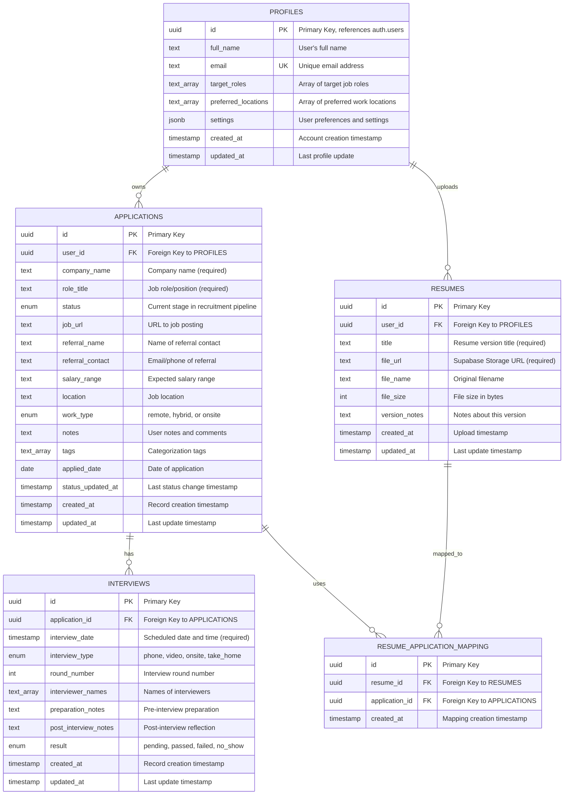

# ApplyPulse Database Schema - Entity Relationship Diagram

## Mermaid ERD Code



## Enum Definitions

### application_status
```sql
CREATE TYPE application_status AS ENUM (
    'wishlist',      -- Jobs to apply to
    'applied',       -- Application submitted
    'assessment',    -- Online assessment/coding challenge
    'interview',     -- Interview scheduled or in progress
    'offer',         -- Offer received
    'rejected',      -- Application rejected
    'accepted'       -- Offer accepted
);
```

### work_type
```sql
CREATE TYPE work_type AS ENUM (
    'remote',
    'hybrid',
    'onsite'
);
```

### interview_type
```sql
CREATE TYPE interview_type AS ENUM (
    'phone',         -- Phone screening
    'video',         -- Video interview
    'onsite',        -- In-person interview
    'take_home'      -- Take-home assignment
);
```

### interview_result
```sql
CREATE TYPE interview_result AS ENUM (
    'pending',       -- Not yet completed
    'passed',        -- Moved to next round
    'failed',        -- Did not pass
    'no_show'        -- Candidate missed interview
);
```

## Supabase Migration SQL

```sql
-- =============================================
-- ApplyPulse Database Schema
-- Version: 1.0
-- =============================================

-- Enable UUID extension
CREATE EXTENSION IF NOT EXISTS "uuid-ossp";

-- =============================================
-- ENUM TYPES
-- =============================================

CREATE TYPE application_status AS ENUM (
    'wishlist',
    'applied',
    'assessment',
    'interview',
    'offer',
    'rejected',
    'accepted'
);

CREATE TYPE work_type AS ENUM (
    'remote',
    'hybrid',
    'onsite'
);

CREATE TYPE interview_type AS ENUM (
    'phone',
    'video',
    'onsite',
    'take_home'
);

CREATE TYPE interview_result AS ENUM (
    'pending',
    'passed',
    'failed',
    'no_show'
);

-- =============================================
-- PROFILES TABLE
-- =============================================

CREATE TABLE profiles (
    id UUID PRIMARY KEY REFERENCES auth.users(id) ON DELETE CASCADE,
    full_name TEXT NOT NULL,
    email TEXT UNIQUE NOT NULL,
    target_roles TEXT[] DEFAULT '{}',
    preferred_locations TEXT[] DEFAULT '{}',
    settings JSONB DEFAULT '{}',
    created_at TIMESTAMP WITH TIME ZONE DEFAULT NOW(),
    updated_at TIMESTAMP WITH TIME ZONE DEFAULT NOW()
);

-- Index for email lookups
CREATE INDEX idx_profiles_email ON profiles(email);

-- =============================================
-- APPLICATIONS TABLE
-- =============================================

CREATE TABLE applications (
    id UUID PRIMARY KEY DEFAULT uuid_generate_v4(),
    user_id UUID NOT NULL REFERENCES profiles(id) ON DELETE CASCADE,
    company_name TEXT NOT NULL,
    role_title TEXT NOT NULL,
    status application_status NOT NULL DEFAULT 'wishlist',
    job_url TEXT,
    referral_name TEXT,
    referral_contact TEXT,
    salary_range TEXT,
    location TEXT,
    work_type work_type,
    notes TEXT,
    tags TEXT[] DEFAULT '{}',
    applied_date DATE,
    status_updated_at TIMESTAMP WITH TIME ZONE DEFAULT NOW(),
    created_at TIMESTAMP WITH TIME ZONE DEFAULT NOW(),
    updated_at TIMESTAMP WITH TIME ZONE DEFAULT NOW()
);

-- Indexes for common queries
CREATE INDEX idx_applications_user_id ON applications(user_id);
CREATE INDEX idx_applications_status ON applications(status);
CREATE INDEX idx_applications_company_name ON applications(company_name);
CREATE INDEX idx_applications_applied_date ON applications(applied_date);

-- =============================================
-- RESUMES TABLE
-- =============================================

CREATE TABLE resumes (
    id UUID PRIMARY KEY DEFAULT uuid_generate_v4(),
    user_id UUID NOT NULL REFERENCES profiles(id) ON DELETE CASCADE,
    title TEXT NOT NULL,
    file_url TEXT NOT NULL,
    file_name TEXT NOT NULL,
    file_size INTEGER,
    version_notes TEXT,
    created_at TIMESTAMP WITH TIME ZONE DEFAULT NOW(),
    updated_at TIMESTAMP WITH TIME ZONE DEFAULT NOW()
);

-- Index for user lookups
CREATE INDEX idx_resumes_user_id ON resumes(user_id);

-- =============================================
-- INTERVIEWS TABLE
-- =============================================

CREATE TABLE interviews (
    id UUID PRIMARY KEY DEFAULT uuid_generate_v4(),
    application_id UUID NOT NULL REFERENCES applications(id) ON DELETE CASCADE,
    interview_date TIMESTAMP WITH TIME ZONE NOT NULL,
    interview_type interview_type NOT NULL,
    round_number INTEGER DEFAULT 1,
    interviewer_names TEXT[] DEFAULT '{}',
    preparation_notes TEXT,
    post_interview_notes TEXT,
    result interview_result DEFAULT 'pending',
    created_at TIMESTAMP WITH TIME ZONE DEFAULT NOW(),
    updated_at TIMESTAMP WITH TIME ZONE DEFAULT NOW()
);

-- Indexes for queries
CREATE INDEX idx_interviews_application_id ON interviews(application_id);
CREATE INDEX idx_interviews_interview_date ON interviews(interview_date);

-- =============================================
-- RESUME_APPLICATION_MAPPING TABLE
-- =============================================

CREATE TABLE resume_application_mapping (
    id UUID PRIMARY KEY DEFAULT uuid_generate_v4(),
    resume_id UUID NOT NULL REFERENCES resumes(id) ON DELETE CASCADE,
    application_id UUID NOT NULL REFERENCES applications(id) ON DELETE CASCADE,
    created_at TIMESTAMP WITH TIME ZONE DEFAULT NOW(),
    UNIQUE(resume_id, application_id)
);

-- Indexes for lookups
CREATE INDEX idx_resume_mapping_resume_id ON resume_application_mapping(resume_id);
CREATE INDEX idx_resume_mapping_application_id ON resume_application_mapping(application_id);

-- =============================================
-- TRIGGERS FOR UPDATED_AT
-- =============================================

CREATE OR REPLACE FUNCTION update_updated_at_column()
RETURNS TRIGGER AS $$
BEGIN
    NEW.updated_at = NOW();
    RETURN NEW;
END;
$$ LANGUAGE plpgsql;

CREATE TRIGGER update_profiles_updated_at
    BEFORE UPDATE ON profiles
    FOR EACH ROW
    EXECUTE FUNCTION update_updated_at_column();

CREATE TRIGGER update_applications_updated_at
    BEFORE UPDATE ON applications
    FOR EACH ROW
    EXECUTE FUNCTION update_updated_at_column();

CREATE TRIGGER update_resumes_updated_at
    BEFORE UPDATE ON resumes
    FOR EACH ROW
    EXECUTE FUNCTION update_updated_at_column();

CREATE TRIGGER update_interviews_updated_at
    BEFORE UPDATE ON interviews
    FOR EACH ROW
    EXECUTE FUNCTION update_updated_at_column();

-- =============================================
-- TRIGGER FOR STATUS_UPDATED_AT
-- =============================================

CREATE OR REPLACE FUNCTION update_status_updated_at()
RETURNS TRIGGER AS $$
BEGIN
    IF NEW.status IS DISTINCT FROM OLD.status THEN
        NEW.status_updated_at = NOW();
    END IF;
    RETURN NEW;
END;
$$ LANGUAGE plpgsql;

CREATE TRIGGER update_applications_status_updated_at
    BEFORE UPDATE ON applications
    FOR EACH ROW
    EXECUTE FUNCTION update_status_updated_at();

-- =============================================
-- ROW LEVEL SECURITY (RLS)
-- =============================================

-- Enable RLS on all tables
ALTER TABLE profiles ENABLE ROW LEVEL SECURITY;
ALTER TABLE applications ENABLE ROW LEVEL SECURITY;
ALTER TABLE resumes ENABLE ROW LEVEL SECURITY;
ALTER TABLE interviews ENABLE ROW LEVEL SECURITY;
ALTER TABLE resume_application_mapping ENABLE ROW LEVEL SECURITY;

-- Profiles policies
CREATE POLICY "Users can view their own profile"
    ON profiles FOR SELECT
    USING (auth.uid() = id);

CREATE POLICY "Users can update their own profile"
    ON profiles FOR UPDATE
    USING (auth.uid() = id);

CREATE POLICY "Users can insert their own profile"
    ON profiles FOR INSERT
    WITH CHECK (auth.uid() = id);

-- Applications policies
CREATE POLICY "Users can view their own applications"
    ON applications FOR SELECT
    USING (auth.uid() = user_id);

CREATE POLICY "Users can insert their own applications"
    ON applications FOR INSERT
    WITH CHECK (auth.uid() = user_id);

CREATE POLICY "Users can update their own applications"
    ON applications FOR UPDATE
    USING (auth.uid() = user_id);

CREATE POLICY "Users can delete their own applications"
    ON applications FOR DELETE
    USING (auth.uid() = user_id);

-- Resumes policies
CREATE POLICY "Users can view their own resumes"
    ON resumes FOR SELECT
    USING (auth.uid() = user_id);

CREATE POLICY "Users can insert their own resumes"
    ON resumes FOR INSERT
    WITH CHECK (auth.uid() = user_id);

CREATE POLICY "Users can update their own resumes"
    ON resumes FOR UPDATE
    USING (auth.uid() = user_id);

CREATE POLICY "Users can delete their own resumes"
    ON resumes FOR DELETE
    USING (auth.uid() = user_id);

-- Interviews policies
CREATE POLICY "Users can view interviews for their applications"
    ON interviews FOR SELECT
    USING (
        EXISTS (
            SELECT 1 FROM applications
            WHERE applications.id = interviews.application_id
            AND applications.user_id = auth.uid()
        )
    );

CREATE POLICY "Users can insert interviews for their applications"
    ON interviews FOR INSERT
    WITH CHECK (
        EXISTS (
            SELECT 1 FROM applications
            WHERE applications.id = application_id
            AND applications.user_id = auth.uid()
        )
    );

CREATE POLICY "Users can update interviews for their applications"
    ON interviews FOR UPDATE
    USING (
        EXISTS (
            SELECT 1 FROM applications
            WHERE applications.id = interviews.application_id
            AND applications.user_id = auth.uid()
        )
    );

CREATE POLICY "Users can delete interviews for their applications"
    ON interviews FOR DELETE
    USING (
        EXISTS (
            SELECT 1 FROM applications
            WHERE applications.id = interviews.application_id
            AND applications.user_id = auth.uid()
        )
    );

-- Resume mapping policies
CREATE POLICY "Users can view their own resume mappings"
    ON resume_application_mapping FOR SELECT
    USING (
        EXISTS (
            SELECT 1 FROM applications
            WHERE applications.id = resume_application_mapping.application_id
            AND applications.user_id = auth.uid()
        )
    );

CREATE POLICY "Users can insert their own resume mappings"
    ON resume_application_mapping FOR INSERT
    WITH CHECK (
        EXISTS (
            SELECT 1 FROM applications
            WHERE applications.id = application_id
            AND applications.user_id = auth.uid()
        )
    );

CREATE POLICY "Users can delete their own resume mappings"
    ON resume_application_mapping FOR DELETE
    USING (
        EXISTS (
            SELECT 1 FROM applications
            WHERE applications.id = resume_application_mapping.application_id
            AND applications.user_id = auth.uid()
        )
    );

-- =============================================
-- STORAGE BUCKET FOR RESUMES
-- =============================================

-- Create storage bucket (run this via Supabase Dashboard or CLI)
-- INSERT INTO storage.buckets (id, name, public) VALUES ('resumes', 'resumes', false);

-- Storage policies (allow authenticated users to upload their own resumes)
-- CREATE POLICY "Users can upload their own resumes"
--     ON storage.objects FOR INSERT
--     WITH CHECK (bucket_id = 'resumes' AND auth.uid()::text = (storage.foldername(name))[1]);

-- CREATE POLICY "Users can view their own resumes"
--     ON storage.objects FOR SELECT
--     USING (bucket_id = 'resumes' AND auth.uid()::text = (storage.foldername(name))[1]);

-- CREATE POLICY "Users can delete their own resumes"
--     ON storage.objects FOR DELETE
--     USING (bucket_id = 'resumes' AND auth.uid()::text = (storage.foldername(name))[1]);

-- =============================================
-- HELPFUL VIEWS
-- =============================================

-- View: Application funnel statistics
CREATE OR REPLACE VIEW application_funnel_stats AS
SELECT 
    user_id,
    COUNT(*) as total_applications,
    COUNT(*) FILTER (WHERE status = 'wishlist') as wishlist_count,
    COUNT(*) FILTER (WHERE status = 'applied') as applied_count,
    COUNT(*) FILTER (WHERE status = 'assessment') as assessment_count,
    COUNT(*) FILTER (WHERE status = 'interview') as interview_count,
    COUNT(*) FILTER (WHERE status = 'offer') as offer_count,
    COUNT(*) FILTER (WHERE status = 'rejected') as rejected_count,
    COUNT(*) FILTER (WHERE status = 'accepted') as accepted_count,
    ROUND(
        COUNT(*) FILTER (WHERE status IN ('interview', 'offer', 'accepted'))::numeric / 
        NULLIF(COUNT(*) FILTER (WHERE status != 'wishlist'), 0) * 100, 
        2
    ) as response_rate_percentage
FROM applications
GROUP BY user_id;

-- =============================================
-- FUNCTIONS
-- =============================================

-- Function: Get upcoming interviews
CREATE OR REPLACE FUNCTION get_upcoming_interviews(days_ahead INTEGER DEFAULT 7)
RETURNS TABLE (
    interview_id UUID,
    application_id UUID,
    company_name TEXT,
    role_title TEXT,
    interview_date TIMESTAMP WITH TIME ZONE,
    interview_type interview_type,
    round_number INTEGER
) AS $$
BEGIN
    RETURN QUERY
    SELECT 
        i.id as interview_id,
        i.application_id,
        a.company_name,
        a.role_title,
        i.interview_date,
        i.interview_type,
        i.round_number
    FROM interviews i
    JOIN applications a ON i.application_id = a.id
    WHERE 
        i.interview_date >= NOW() 
        AND i.interview_date <= NOW() + (days_ahead || ' days')::INTERVAL
        AND a.user_id = auth.uid()
    ORDER BY i.interview_date ASC;
END;
$$ LANGUAGE plpgsql SECURITY DEFINER;

-- =============================================
-- SEED DATA (Optional - for testing)
-- =============================================

-- Note: This is commented out for production
-- Uncomment for local development/testing

/*
-- Example profile
INSERT INTO profiles (id, full_name, email, target_roles, preferred_locations)
VALUES (
    'f47ac10b-58cc-4372-a567-0e02b2c3d479',
    'Sarah Johnson',
    'sarah@example.com',
    ARRAY['Software Engineer', 'Full-Stack Developer'],
    ARRAY['San Francisco', 'Remote']
);

-- Example applications
INSERT INTO applications (user_id, company_name, role_title, status, applied_date)
VALUES 
    ('f47ac10b-58cc-4372-a567-0e02b2c3d479', 'Google', 'Software Engineer', 'interview', '2026-03-15'),
    ('f47ac10b-58cc-4372-a567-0e02b2c3d479', 'Meta', 'Frontend Developer', 'applied', '2026-03-20'),
    ('f47ac10b-58cc-4372-a567-0e02b2c3d479', 'Amazon', 'Full-Stack Engineer', 'wishlist', NULL);
*/
```

## Schema Visualization

### Tables Summary
| Table | Records Per User | Purpose |
|-------|------------------|---------|
| profiles | 1 | User account settings |
| applications | Many | Job application tracking |
| resumes | Multiple | Resume version management |
| interviews | Multiple | Interview scheduling |
| resume_application_mapping | Many-to-Many | Links resumes to applications |

### Relationships
- One user (profile) has many applications
- One user has many resumes
- One application can have multiple interviews
- Many-to-many: Applications ↔ Resumes

### Key Features
- ✅ Full Row Level Security (RLS)
- ✅ Automatic timestamp tracking
- ✅ Cascade deletes for data integrity
- ✅ Optimized indexes for performance
- ✅ Helpful views for analytics
- ✅ Utility functions for common queries

---

**Generated:** March 2026  
**Status:** ✅ Ready for Implementation  
**Next Step:** Initialize Next.js Project
